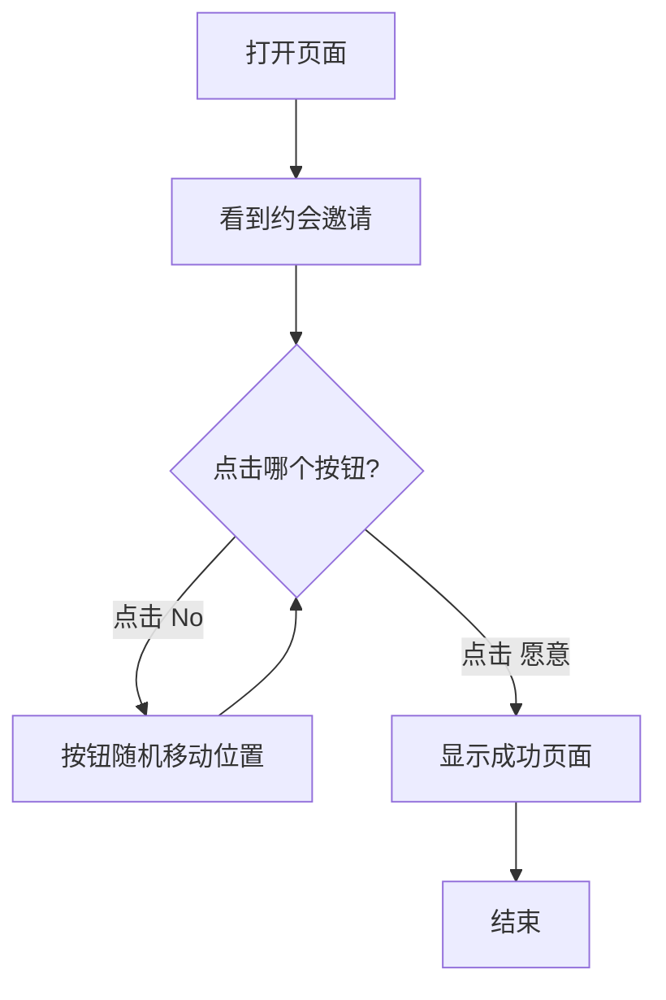

## 1. Product Overview
一个浪漫有趣的约会邀请网页应用，通过互动游戏的方式向女朋友发出约会邀请，增加趣味性和惊喜感。

## 2. Core Features

### 2.1 Feature Module
1. **约会邀请页**: 核心互动页面，包含浪漫文案和两个选项按钮

### 2.2 Page Details
| Page Name | Module Name | Feature description |
|-----------|-------------|---------------------|
| 约会邀请页 | 主交互区域 | 显示浪漫文案"你愿不愿意和我约会"，提供"愿意"和"No"两个按钮选项 |
| 约会邀请页 | 拒绝按钮交互 | 点击"No"按钮时，按钮会随机变换位置，无法被选中 |
| 约会邀请页 | 接受按钮交互 | 点击"愿意"按钮时，显示甜蜜的成功页面 |

## 3. Core Process
用户打开页面看到约会邀请 → 点击"No"按钮，按钮随机移动 → 多次尝试后点击"愿意" → 显示成功祝福页面

## 4. User Interface Design
### 4.1 Design Style
- 主色调：浪漫粉色系 (#FF6B9D, #FF8FAB)
- 辅助色：柔和白色和浅灰色
- 按钮风格：圆角、渐变、3D悬浮效果
- 字体：优雅的无衬线字体，标题使用较大字号
- 背景：渐变粉色背景，带有爱心装饰元素
- 动画：按钮悬停效果、拒绝按钮弹跳动画、成功页面庆祝动画

### 4.2 Page Design Overview
| Page Name | Module Name | UI Elements |
|-----------|-------------|-------------|
| 约会邀请页 | 主交互区域 | 居中布局，大标题，两个按钮并排显示 |
| 约会邀请页 | 拒绝按钮 | 红色按钮，点击时触发随机移动动画 |
| 约会邀请页 | 接受按钮 | 粉色渐变按钮，悬停时有发光效果 |
| 成功页面 | 庆祝动画 | 爱心飘落动画，甜蜜祝福语 |

### 4.3 Responsiveness
移动端自适应，按钮尺寸和间距根据屏幕大小调整，支持触摸操作

### 4.4 动画效果
- 拒绝按钮：点击时弹跳并随机移动到新位置
- 接受按钮：悬停时放大和发光效果
- 成功页面：爱心飘落、文字渐入动画