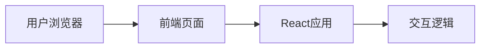

## 1. Architecture Design


## 2. Technology Description
- Frontend: React@18 + tailwindcss@3 + vite
- Initialization Tool: vite-init
- Backend: None (纯前端应用)
- Database: None

## 3. Route Definitions
| Route | Purpose |
|-------|---------|
| / | 约会邀请主页面 |

## 4. API Definitions
无后端API，纯前端交互

## 5. Data Model
无数据持久化需求

## 6. Project Structure
```
src/
├── App.tsx          # 主应用组件
├── main.tsx         # 入口文件
├── index.css        # 全局样式
├── components/
│   ├── InvitationPage.tsx   # 约会邀请页面
│   ├── YesButton.tsx        # 愿意按钮
│   ├── NoButton.tsx         # No按钮（会移动）
│   └── SuccessPage.tsx      # 成功页面
└── hooks/
    └── useRandomPosition.ts # 随机位置hook
```

## 7. 核心逻辑
- No按钮：点击时生成随机X/Y坐标，通过CSS transform移动
- 成功页面：状态管理切换显示成功内容
- 动画：CSS transitions和keyframes实现流畅动画